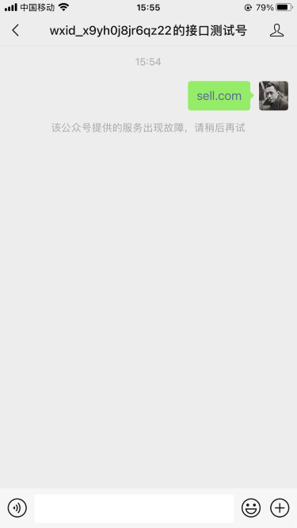
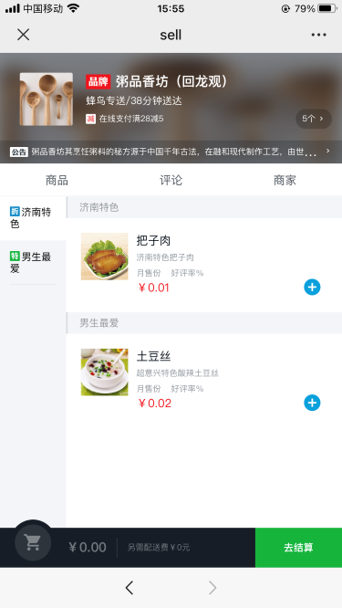
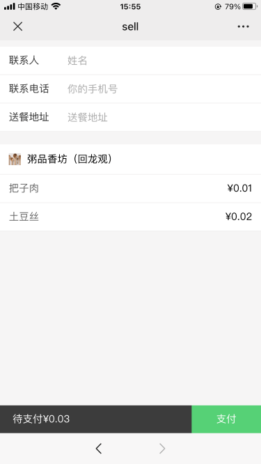
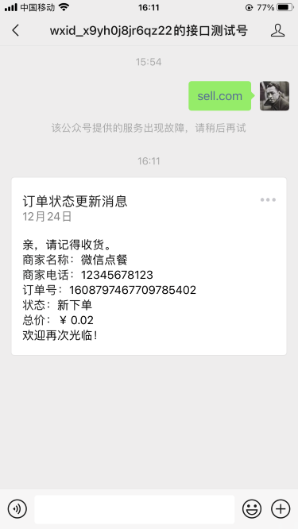
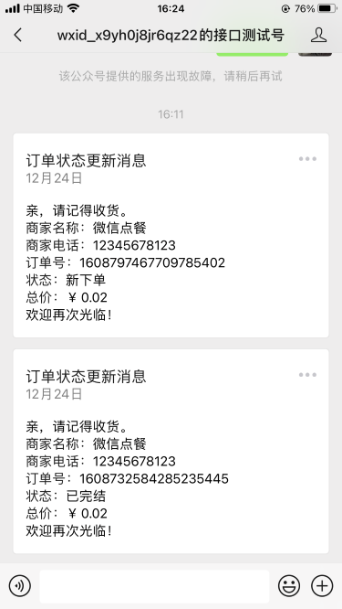
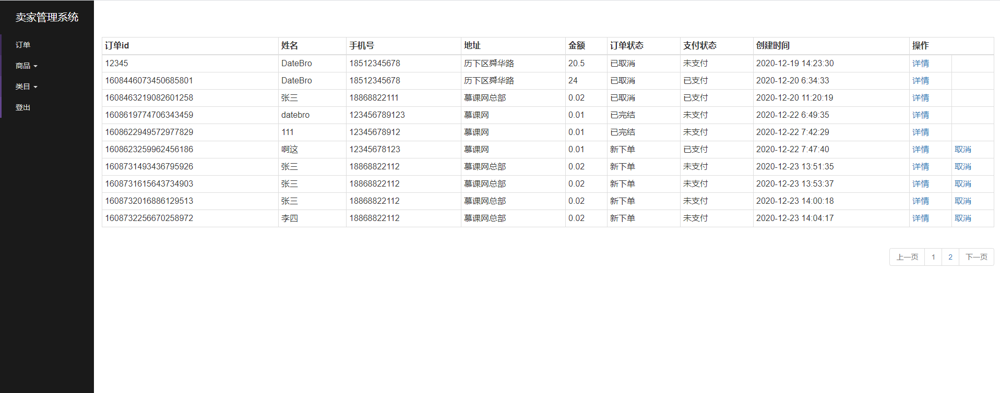

# 基于SpringBoot的微信点餐系统

## 项目展示

### 买家端

买家端使用的是别人已经写好的[前端代码](https://coding.imooc.com/class/74.html)，最终效果如下：

获取买家openid需要使用微信测试号

### 商品列表页面

### 买家下单页面

微信支付需要借用廖师兄的支付账号，但这样没法自动获取openid，只能通过师兄给的url进行调试。通过设置url中的orderId发起支付，支付截图就不放了。

### 模板消息通知买家订单状态更新

模板消息可以使用测试账号，但订单状态更新只能使用postman来调试了。效果如下：

新下单：

完结订单:

### 卖家端

#### 微信授权登录

由于微信公众平台测试账号没有微信授权登录权限，所以需要借用廖师兄提供的调试链接进行登录调试。
效果如下：

#### 订单列表

登录后跳转到订单列表页面：

商品、类目列表和订单列表大同小异，这里就不展示了。

## 慕课网实战课程地址：				
[Spring Boot 企业微信点餐系统](https://coding.imooc.com/learn/list/117.html)	      
[Vue.js 2.5 + cube-ui 重构饿了么 App](https://coding.imooc.com/class/74.html)